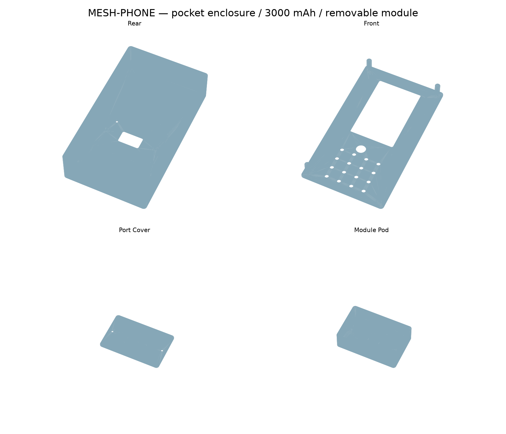
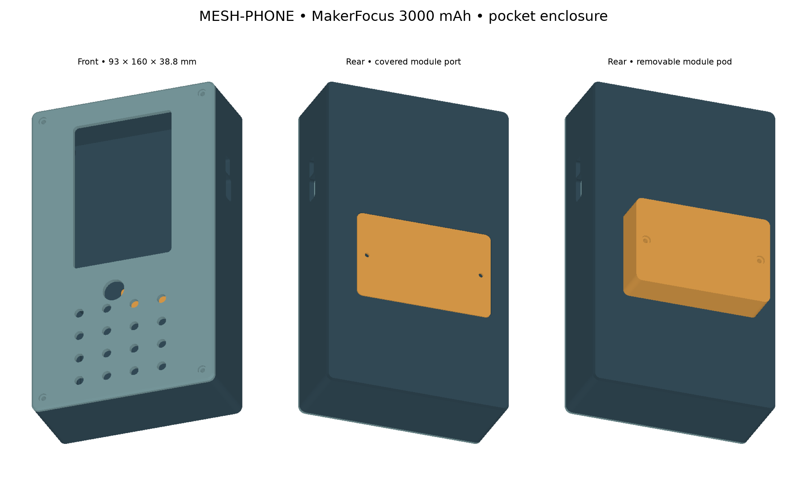

# MESH-PHONE

ESP32-S3 handheld hardware with sub-GHz radios, LTE, NFC/RFID, a 4×4 keypad,
trackball, GPS and a rear expansion connector. Engineering prototype. **DO NOT FABRICATE OR POWER:** the current handset
is incomplete and only partially routed.

## Project layout

| Directory | Contents |
|---|---|
| [hardware/rev-f](hardware/rev-f/README.md) | Preserved GPS/expansion revision; superseded by the handset redesign |
| [hardware/handset-rev-a](hardware/handset-rev-a/README.md) | Active handset PCB and schematic; open `generated/handset.kicad_pro` |
| `hardware/main/` | Preserved original KiCad project and its local footprints |
| [mechanical/handset](mechanical/handset/README.md) | Latest reference-inspired handset concept; requires new PCB |
| [mechanical/enclosure](mechanical/enclosure/README.md) | Preserved enclosure for the existing Rev F board |
| `scripts/` | Maintained geometry extraction and revision verification |
| `docs/design/` | Historical design notes, pin budgets and routing notes |
| `docs/reviews/` | Electrical review evidence |
| `manufacturing/` | BOMs and explicitly unreleased legacy fabrication exports |
| `archive/` | Prior PCB candidates, enclosure and one-off development scripts |

## Working with the project

Open `hardware/handset-rev-a/generated/handset.kicad_pro` in KiCad 10.
Keep its local symbol and footprint libraries beside the project. The current
checkpoint was checked with KiCad 10.0.6.

Run `bash scripts/check_handset_pcb.sh` to refresh the native netlist, ERC/DRC,
connectivity checks, schematic PDF and previews. Then run
`python3 scripts/check_handset_release.py` to evaluate the release gate.
**The release gate currently fails intentionally:** passing artifact-integrity
checks does not mean the electronics are ready to manufacture.

For the preserved Rev F project, `python3 scripts/verify_revF.py` checks its saved
netlist and placement contracts; it does not run fresh native electrical analysis.

Run `python scripts/enclosure_geometry.py` after PCB mechanical changes, then
`scripts/export_enclosure.sh` to rebuild the enclosure STLs and preview.
See the mechanical README for panel-placement assumptions and fit checks.

Archived scripts preserve historical experiments, including obsolete absolute
paths and old project names. They are not a supported build pipeline and should
not be replayed on the active board. `.history/` is the existing KiCad history
repository and remains in place.

Latest appearance: [handset preview](mechanical/handset/exports/design-preview.png).
See [feature preservation](mechanical/handset/FEATURES.md) for the retained hardware
requirements and explicit packaging changes. Build with `scripts/export_handset.sh`.
The selected new-board materials list is in
[`hardware/handset-rev-a/materials-to-use.csv`](hardware/handset-rev-a/materials-to-use.csv).
The supporting component research and comparison table are in
[`docs/research/new-pcb-component-study.md`](docs/research/new-pcb-component-study.md)
and [`hardware/handset-rev-a/candidate-components.csv`](hardware/handset-rev-a/candidate-components.csv).

## Fabrication readiness checklist

Checkpoint: **2026-09-24**. Checked items mean the stated design-file work is
complete, not that the hardware has passed bench testing. Current status:
**218 schematic components, 1,957 passing integrity checks, zero schematic/PCB
parity findings, 30 ERC findings, four USB hole-clearance DRC findings, and
491 unconnected items.** Eleven engineering blocker groups remain open.
The detailed source of truth is
[release-blockers.json](hardware/handset-rev-a/release-blockers.json).

### Completed design work

- [x] Organize hardware, mechanical designs, research, reviews and archived checkpoints.
- [x] Create the four-layer handset PCB and rebuild the schematic as a system index plus 21 functional sheets.
- [x] Retain ESP32-S3-WROOM-1-N16R8 and preserve interfaces for the external display, keypad, trackball, cellular adapter, radios, GNSS, NFC/LF RFID, storage, IR, audio and expansion.
- [x] Capture MakerFocus 3000 mAh battery requirements and the external-module connector; exact pack qualification remains below.
- [x] Populate the current schematic/PCB with component footprints and a materials list; final BOM and footprint audits remain below.
- [x] Capture BQ25186 charging, fused USB/battery entry, TPS25200 protection, TUSB320LAI source detection and TCA9536 controls; verify continuity of 113 local power-entry pads.
- [x] Record and check the charger-policy contract; firmware implementation remains below.
- [x] Route the local TPS63802 main 3.3 V regulator circuit; verify continuity of 26 pads.
- [x] Capture auxiliary supplies and the regulated modem supply/enable circuit; complete routing and load qualification remain below.
- [x] Capture the CC1101 clock, 868/915 MHz matching/filter, supply bypass and GDO2 test pad; pass 90 topology/value checks and five negative tests.
- [x] Add SX1262 core DC-DC support, correct its VREG capacitor to 470 nF, and specify input bypass parts; pass 30 circuit checks and four negative tests.
- [x] Capture GNSS, display/touch/backlight, audio, storage/IR, NFC/LF support and protected expansion interfaces; incomplete support circuits are listed below.
- [x] Preserve prior CAD checkpoints and existing routed copper during staged updates.
- [x] Add repeatable checks, schematic PDF and board/assembly previews. Current placement checks report no overlaps; fabrication release remains blocked.

### Remaining before first prototype fabrication

Work through these in order; circuit and mechanical decisions must be resolved
before final routing and manufacturing exports.

- [ ] **Battery and charging:** verify the purchased pack's dimensions, polarity, connector, protection limits and allowable charge/discharge currents; resolve handset/modem peak-current demand and powered-off charging. Confirm NTC attachment and charge-temperature limits. Implement charger policy, fault handling and source recovery; finish power-control/I2C routing.
- [ ] **Power supplies:** finish U7 distribution and U10/U11/U20 regulator layouts. Calculate worst-case inductor current, capacitor DC bias, feedback tolerance, thermal dissipation, startup/UVLO and modem burst margin. Define current-limited bring-up limits and test points.
- [ ] **Cellular adapter:** freeze an orderable modem variant, firmware, SIM interface, logic translation and call-audio circuit. Verify supported bands and carrier VoLTE requirements; interchangeable adapters do not guarantee every carrier. Select the call microphone and speaker/harness arrangement.
- [ ] **SX1262 LoRa:** finish the 32 MHz TCXO, DIO3 supply/coupling and startup requirements; complete PA choke/bypass, RF switch, matching/filter and antenna feed. Verify exact MPNs, pin maps and control truth tables; route the core regulator and RF circuits.
- [ ] **CC1101:** refine and route the oscillator, bypass, balun/filter and separate antenna feed against the selected stackup. Review crystal load/drive and the optional spur filter; define firmware SPI/GDO configuration.
- [ ] **NFC and LF RFID:** finish ST25R3916B matching/receive circuitry and HTRC110 clock, analog reference, coil network and timing-capable host return path. Specify external coils, crystal loading and tuning provisions.
- [ ] **GNSS:** finish MAX-M10S decoupling and RF feed; select the passive antenna and verify mounting, keepouts and coexistence requirements.
- [ ] **Expansion and USB:** finish current-limited J16 power and ESD-protected signal routing, power-off module exchange policy and controlled-impedance USB data routing. Resolve the four USB1 internal hole-clearance findings against the GCT drawing and fabricator capabilities.
- [ ] **Display, controls and peripherals:** confirm the purchased display/touch configuration, FPC contact orientation, supply/backlight requirements and GPIO budget. Review keypad-scanner controls, shared SPI chip selects, IR boot behavior, microSD and audio interfaces; implement the firmware needed for safe bring-up.
- [ ] **Antennas and coexistence:** select actual LTE, LoRa, CC1101, GNSS and Wi-Fi/BLE antenna arrangements, cable/connectors and matching provisions. Establish ground clearance, spacing and simultaneous-transmit policy; retain access for RF measurements.
- [ ] **BOM and footprints:** freeze all orderable parts with tolerance, voltage, power, dielectric, temperature and lifecycle requirements. Independently audit every custom symbol pin map, package, exposed pad, paste pattern, orientation and connector mating direction. Define DNP options and approved substitutions.
- [ ] **Mechanical fit:** reconcile the PCB with the pocketable case, actual battery, external screen/FPC, trackball opening and retention, top speaker, bottom microphone, antennas, mounting hardware and external module port. Check populated heights, cable bends and moved power-switch access using a full assembly model and fit prototype.
- [ ] **Fabricator rules:** agree the four-layer stackup, copper weights, impedance targets, drill/via limits, solder-mask rules and ESP32 via-in-pad filling/capping requirements with the chosen fabricator. Resolve RF reference via sizes against those capabilities.
- [ ] **Complete PCB routing:** connect all 491 currently unconnected items; finish return planes, ground stitching, thermal paths and supply distribution. Review switching loops, RF/USB impedance, antenna keepouts and analog/digital interference. Recheck clearances after all placement changes.
- [ ] **Independent electrical review:** check every pin and power state against manufacturer documents, including boot straps, pull resistors, power sequencing, unpowered interfaces and test access. Close each blocker with evidence rather than marking an incomplete subsystem complete.
- [ ] **Final native checks:** regenerate netlist/ERC/DRC from the exact release revision; resolve the 30 current ERC findings, four DRC findings and all airwires. Require zero parity errors and passing circuit/continuity checks. Any genuinely intentional rule exception needs a documented engineering justification, not a blanket waiver.
- [ ] **Prototype manufacturing package:** export and inspect Gerbers, plated/non-plated drill files, fabrication drawing/stackup, assembly drawings, full MPN BOM, DNP list and pick-and-place files. Verify units, origin, bottom-side rotation, pin 1, polarity and layer alignment in an independent viewer; obtain fabricator/assembler DFM feedback.
- [ ] **Prototype release:** review the complete package and bring-up plan, close the applicable prototype blockers, tag the exact Git revision and archive checksums/reports with the exports. Update the release gate to distinguish an approved prototype from production qualification. Only then authorize a small prototype build.

### After prototype assembly, before production release

These require physical hardware and therefore cannot be prerequisites for
fabricating the first engineering prototypes.

- [ ] Inspect assembly and check shorts/polarity before applying power; bring up each rail on a current-limited supply with the battery initially disconnected.
- [ ] Measure charge limits, NTC/fault response, protected-pack behavior, powered-off charging, source switching, sleep current, runtime, rail stability, thermal rise and worst-case modem/radio bursts.
- [ ] Validate oscillator startup/frequency/drive, LoRa and CC1101 conducted power/sensitivity, spurious emissions, antenna matching and RF coexistence in the assembled case; tune NFC/LF coils and verify GNSS reception.
- [ ] Test calls/SMS/data with the selected adapters and supported carriers, SIM operation, call/media audio, display/touch, keypad combinations, trackball, storage, IR, GNSS/PPS and expansion functions.
- [ ] Test USB/expansion faults and ESD response, power interruption/recovery, firmware update/recovery and repeated accessory connection cycles.
- [ ] Validate enclosure fit, connector access/retention, drops, pocket pressure, temperature and battery protection from mechanical damage.
- [ ] Complete required EMC/radio/product compliance assessment and testing for intended markets and operating modes.
- [ ] Correct prototype findings, repeat affected checks/tests, freeze production BOM/firmware and create assembly test fixtures, programming instructions, acceptance limits and traceability records.
- [ ] Obtain independent final review and release a versioned production manufacturing package only after all qualification evidence is recorded.

Implementation evidence: [power entry](hardware/handset-rev-a/power-entry-review.md),
[3.3 V layout](hardware/handset-rev-a/3v3-layout-review.md),
[schematic rebuild](hardware/handset-rev-a/schematic-rebuild-review.md),
[CC1101](hardware/handset-rev-a/cc1101-review.md), and
[SX1262 power](hardware/handset-rev-a/sx1262-power-review.md).
