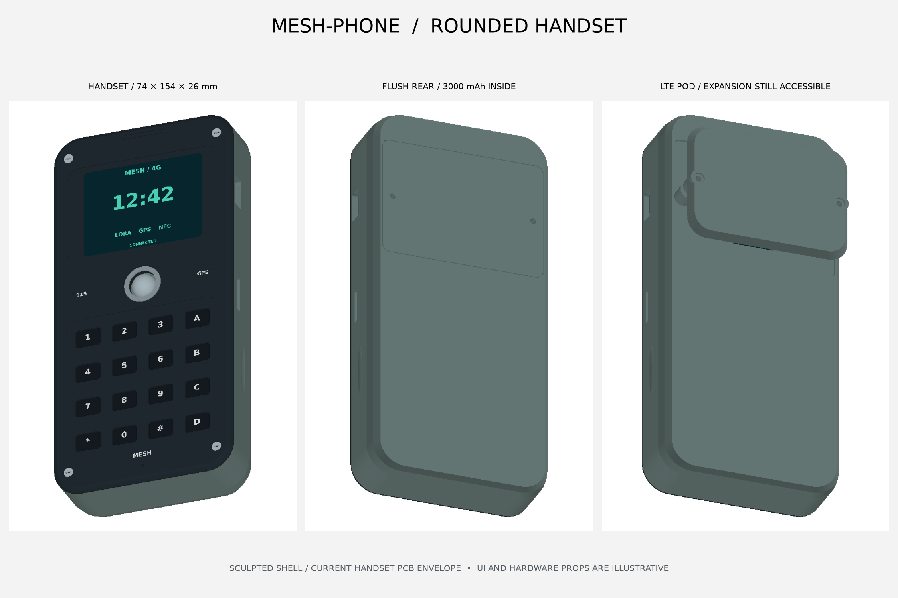

# MESH-PHONE

ESP32-S3 handheld hardware with sub-GHz radios, LTE, NFC/RFID, a 4×4 keypad,
trackball, GPS and a rear expansion connector. Engineering prototype. **DO NOT FABRICATE OR POWER:** the current handset
is incomplete and only partially routed.

## Project layout

| Directory | Contents |
|---|---|
| [hardware/rev-f](hardware/rev-f/README.md) | Preserved GPS/expansion revision; superseded by the handset redesign |
| [hardware/handset-rev-a](hardware/handset-rev-a/README.md) | Active handset PCB and schematic; open `generated/handset.kicad_pro` |
| `hardware/main/` | Preserved original KiCad project and its local footprints |
| [mechanical/handset](mechanical/handset/README.md) | Latest reference-inspired handset concept; requires new PCB |
| [mechanical/enclosure](mechanical/enclosure/README.md) | Preserved enclosure for the existing Rev F board |
| `scripts/` | Maintained geometry extraction and revision verification |
| `docs/design/` | Historical design notes, pin budgets and routing notes |
| `docs/reviews/` | Electrical review evidence |
| `manufacturing/` | BOMs and explicitly unreleased legacy fabrication exports |
| `archive/` | Prior PCB candidates, enclosure and one-off development scripts |

## Working with the project

Open `hardware/handset-rev-a/generated/handset.kicad_pro` in KiCad 10.
Keep its local symbol and footprint libraries beside the project. The current
checkpoint was checked with KiCad 10.0.6.

Run `bash scripts/check_handset_pcb.sh` to refresh the native netlist, ERC/DRC,
connectivity checks, schematic PDF and previews. Then run
`python3 scripts/check_handset_release.py` to evaluate the release gate.
**The release gate currently fails intentionally:** passing artifact-integrity
checks does not mean the electronics are ready to manufacture.

For the preserved Rev F project, `python3 scripts/verify_revF.py` checks its saved
netlist and placement contracts; it does not run fresh native electrical analysis.

Run `python scripts/enclosure_geometry.py` after PCB mechanical changes, then
`scripts/export_enclosure.sh` to rebuild the enclosure STLs and preview.
See the mechanical README for panel-placement assumptions and fit checks.

Archived scripts preserve historical experiments, including obsolete absolute
paths and old project names. They are not a supported build pipeline and should
not be replayed on the active board. `.history/` is the existing KiCad history
repository and remains in place.

The current enclosure has a sculpted rear, rounded corners and a rolled front
rim. Its maximum body envelope remains 74 × 154 × 26 mm; populated-board fit
and the detachable modem pod still need engineering validation.

Latest appearance: [handset preview](mechanical/handset/exports/design-preview.png).
See [feature preservation](mechanical/handset/FEATURES.md) for the retained hardware
requirements and explicit packaging changes. Build with `scripts/export_handset.sh`.
The selected new-board materials list is in
[`hardware/handset-rev-a/materials-to-use.csv`](hardware/handset-rev-a/materials-to-use.csv).
The supporting component research and comparison table are in
[`docs/research/new-pcb-component-study.md`](docs/research/new-pcb-component-study.md)
and [`hardware/handset-rev-a/candidate-components.csv`](hardware/handset-rev-a/candidate-components.csv).

## Fabrication readiness checklist

Checkpoint: **2026-10-08**. Checked items mean the stated design-file work is
complete, not that the hardware has passed bench testing. Current status:
**275 schematic components, 2,634 passing integrity checks, zero schematic/PCB
parity findings, 20 ERC findings, zero DRC findings, and
245 unconnected items.** Eleven engineering blocker groups remain open.
The detailed source of truth is
[release-blockers.json](hardware/handset-rev-a/release-blockers.json).

Current priority is prototype fabrication readiness: complete the missing circuits,
finish copper and return paths, clear ERC/DRC, freeze the BOM and mechanical fit,
and obtain fabricator/assembler DFM review. Firmware feature work follows this
hardware work. Bench qualification remains required after prototype assembly.

### Completed design work

- [x] Capture SX1262 matching/filter, TX/RX switch, control/supply filters and DC blocks. Eight wrong-wiring/value tests pass; final RF placement and routing remain open. [RF checkpoint](hardware/handset-rev-a/sx1262-power-review.md#rf-matching-and-switch-checkpoint--2026-10-08).
- [x] Connect SX1262 input supplies, bypass capacitors and all ground pins to the established rail/return network. Six open-pad tests and 16-pad continuity pass. [Supply checkpoint](hardware/handset-rev-a/sx1262-power-review.md#input-supply-routing-checkpoint--2026-10-08).
- [x] Route the SX1262 core regulator loop, VREG capacitor return and regulator/exposed-pad ground. Six open-pad controls pass; 15 copper items added with existing copper preserved. [Regulator checkpoint](hardware/handset-rev-a/sx1262-power-review.md#regulator-routing-checkpoint--2026-10-08).
- [x] Capture and route the SX1262 TCXO clock: 14 pads, a 6.789 mm clock path and its ground reference pass checks. ERC falls by three; RF frontend and clock electrical qualification remain open. [Clock checkpoint](hardware/handset-rev-a/sx1262-power-review.md#tcxo-clock-checkpoint--2026-10-08).

- [x] Route amplifier power, ground and local shutdown bias; move C13 beside U6. Fifteen physical pads pass continuity, five regression cases pass, and existing copper remains intact. Speaker/I²S/microphone routing remains open. [Layout checkpoint](hardware/handset-rev-a/README.md#audio-power-routing-checkpoint).

- [x] Cross-build an ESP32-S3 keypad bring-up application with I²C, GPIO8 interrupts, USB logs and start/stop/recovery commands. Twelve session tests and native pin-map checks pass. [Build and commissioning instructions](firmware/bringup/README.md); hardware testing remains open.
- [x] Complete the 16-key matrix copper (72 physical pads), add five routing regression cases and a host-tested keypad driver with overflow recovery. [Routing and firmware evidence](hardware/handset-rev-a/keypad-routing-review.md).
- [x] Route ESP32 boot/reset service controls and U2 power, reset, I²C and interrupt connections; eight regression cases pass with zero DRC/parity findings. [Evidence and remaining bring-up work](hardware/handset-rev-a/core-bringup-review.md).
- [x] Organize hardware, mechanical designs, research, reviews and archived checkpoints.
- [x] Create the four-layer handset PCB and rebuild the schematic as a system index plus 24 functional sheets.
- [x] Retain ESP32-S3-WROOM-1-N16R8 and preserve interfaces for the external display, keypad, trackball, cellular adapter, radios, GNSS, NFC/LF RFID, storage, IR, audio and expansion.
- [x] Capture MakerFocus 3000 mAh battery requirements and the external-module connector; exact pack qualification remains below.
- [x] Populate the current schematic/PCB with component footprints and a materials list; final BOM and footprint audits remain below.
- [x] Capture BQ25186 charging, fused USB/battery entry, TPS25200 protection, TUSB320LAI source detection and TCA9536 controls; verify continuity of 113 local power-entry pads.
- [x] Cross-build and validate an inhibited STM32G031 commissioning image with private-bus I²C, PA0 shutdown, watchdog and diagnostic host interface. [Build, evidence and limits](firmware/power/stm32g031/README.md).
- [x] Route supervisor power, private/host I²C and SWD connections; verify 67 endpoints and preserve existing copper. [Routing evidence and remaining work](hardware/handset-rev-a/supervisor-routing-review.md).
- [x] Route charger VSYS to U7, the main power-switch control, and U7 to ESP32 power/bypass/ground; verify 38 physical pads with no new DRC findings. [Routing evidence and limits](hardware/handset-rev-a/main-distribution-review.md).
- [x] Add and route independent STM32 charge permission so a retained expander output cannot defeat reset inhibition; update controller sequencing and pass topology, continuity and fault tests. [Design and qualification limits](hardware/handset-rev-a/charge-inhibit-review.md).
- [x] Capture and place the separate STM32G031 charging supervisor, always-on regulator and isolated host bus; preserve existing copper geometry. [Circuit and remaining work](hardware/handset-rev-a/power-supervisor-review.md).
- [x] Record the charger-policy contract and implement a host-tested portable charger controller with a 4.17 V target; STM32 supervisor integration and hardware tests remain below.
- [x] Capture published MakerFocus pack specifications and calculate an illustrative modem-load budget; the current pack/modem compatibility blocker remains open.
- [x] Audit modem startup/output tolerance and battery current directly from CAD; add regression tests and release-gate checks. User selected a higher-current ~3000 mAh pack; provisional target is at least 5 A, with pack/fit/F2/J1 qualification still open. [Power review and battery requirements](hardware/handset-rev-a/modem-power-review.md).
- [x] Screen a concrete higher-current pouch and low-profile connector: CU-JAS427 and Molex 2053380002. Pack current clears the provisional calculation, but fit and production qualification fail; neither is frozen. [Candidate evidence and remaining checks](hardware/handset-rev-a/battery-candidate-review.md).
- [x] Replace J1 with the low-profile Molex 2053380002 in schematic and PCB; repair local battery/ground routing, preserve unrelated layout, and verify 118 power-entry pads plus a broken-route negative test. [Connector implementation and fuse screening](hardware/handset-rev-a/battery-connector-review.md).
- [x] Widen the battery-to-fuse main trace to 1.2 mm where clearance permits; reduce its calculated resistance by about 24%, preserve placement, and verify continuity with a broken-trace test. Fuse selection and current/thermal qualification remain open. [Copper and fuse follow-up](hardware/handset-rev-a/battery-copper-review.md).
- [x] Inventory handset loads and add a 60-case battery-only power-envelope check separating the charger-fed handset from the modem. Flag the incomplete 0.25 A allowance and configured handset discharge limit in the release gate. [System power review](hardware/handset-rev-a/system-power-review.md).
- [x] Audit display/backlight and expansion limits; specify four high-power backlight resistors in schematic, PCB and BOM. Add checks for panel supply tolerance and port current limit. [Display and expansion review](hardware/handset-rev-a/display-expansion-power-review.md).
- [x] Capture and place a dedicated 3.0 V display supply, SPI/control buffers and touch I²C translator using specified parts. Preserve shared-bus MISO deselection; update BOM and power inventory. Physical routing is recorded below; electrical qualification remains open. [Display interface review](hardware/handset-rev-a/display-interface-review.md).
- [x] Route and physically verify the dedicated display interface: 25 net groups, including supplies, host/connector signals and grounds. Preserve existing placement/copper; add ground returns and continuity regression tests. [Display routing review](hardware/handset-rev-a/display-routing-review.md).
- [x] Install and route the CAT4004A backlight current driver, replacing Q2/R52–R55; verify 26 endpoints, seven regression tests and no new DRC findings. Preserve existing display continuity. [Implementation and qualification limits](hardware/handset-rev-a/backlight-routing-review.md).
- [x] Capture and route expansion power control, fault sensing and hardware signal isolation; verify 31 physical net groups and six regression tests, and add a host-tested portable controller. Preserve all 4,183 existing copper items. [Implementation and qualification limits](hardware/handset-rev-a/expansion-control-review.md).
- [x] Improve expansion ESD ground returns with local inner-layer pours and a direct U16 ground bridge; remove 36.24 mm of ground detours, preserve all signal routing and pass ground-return regression tests. [Evidence and remaining limits](hardware/handset-rev-a/expansion-control-review.md).
- [x] Clear all four USB connector hole-clearance findings using a dedicated ground-corner-relief footprint; preserve holes, routed copper and board rules. Native DRC is now zero; four geometry regression tests pass. [Footprint change and remaining qualification](hardware/handset-rev-a/usb-connector-review.md).
- [x] Route both USB-C data orientations through ESD protection and 22 Ω host termination; match CAD path lengths, add reference copper and verify seven regression cases. Record the JLC04161H-7628 stackup target; fabricator impedance and electrical qualification remain open. [Routing evidence and limits](hardware/handset-rev-a/usb-data-routing-review.md).
- [x] Route the local TPS63802 main 3.3 V regulator circuit; verify continuity of 26 pads.
- [x] Route U20 local modem converter, feedback, ground and switch-controlled enable network; verify 48 pads with no new DRC findings. [Layout and startup limits](hardware/handset-rev-a/modem-layout-review.md).
- [x] Route U10 local 5 V boost, feedback, ground and switch enable; verify 19 pads with no new DRC findings. [Layout and voltage limits](hardware/handset-rev-a/reg5-layout-review.md).
- [x] Route U10 VSYS feed and LF RFID power/ground for U9/U18; verify 36 pads and preserve existing copper. [Distribution evidence and limits](hardware/handset-rev-a/reg5-distribution-review.md).
- [x] Route the local U11 1.8 V regulator circuit, reposition input bypass and orient the inductor toward SW; verify 15 pads and preserve existing copper. [Layout evidence and remaining qualification](hardware/handset-rev-a/reg18-layout-review.md).
- [x] Connect U7 to U11 input, shorten C28 output/sense paths and verify 17 pads. Audit confirms no external 1.8 V loads are assigned; rail purpose remains open. [Distribution evidence](hardware/handset-rev-a/reg18-distribution-review.md).
- [x] Capture auxiliary supplies and the regulated modem supply/enable circuit; complete routing and load qualification remain below.
- [x] Capture the CC1101 clock, 868/915 MHz matching/filter, supply bypass and GDO2 test pad; pass 90 topology/value checks and five negative tests.
- [x] Add SX1262 core DC-DC support, correct its VREG capacitor to 470 nF, and specify input bypass parts; pass 30 circuit checks and four negative tests.
- [x] Capture GNSS, display/touch/backlight, audio, storage/IR, NFC/LF support and protected expansion interfaces; incomplete support circuits are listed below.
- [x] Preserve prior CAD checkpoints and existing routed copper during staged updates.
- [x] Add repeatable checks, schematic PDF and board/assembly previews. Current placement checks report no overlaps; fabrication release remains blocked.

### Remaining before first prototype fabrication

Work through these in order; circuit and mechanical decisions must be resolved
before final routing and manufacturing exports.

- [ ] **Battery and charging:** qualify a higher-current ~3000 mAh 1S replacement (provisional ≥5 A target), preserving the pocketable design; verify dimensions, polarity, protection, NTC and charge/discharge limits. Re-select F2 and qualify J1/harness/copper for the full handset/modem current budget. Complete STM32 durable fault storage, service rearm and expiring host permissions, qualify reset-time CE inhibition and powered-off charging. Confirm NTC attachment and charge-temperature limits. Implement charger policy, fault handling and source recovery; qualify the routed supervisor power/control buses and finish remaining system distribution.
- [ ] **Power supplies:** finish U7 distribution to the remaining peripheral loads and U20 external battery/modem distribution; resolve the audited 3.71–4.13 V turn-on range (up to 4.21 V with the EN-current screening allowance); qualify the routed U10 display branch for voltage, current and trace sizing; resolve the unused 1.8 V rail (assign justified loads or remove it), then finalize U11 output/sense layout. Calculate worst-case inductor current, capacitor DC bias, feedback tolerance, thermal dissipation, startup/UVLO and modem burst margin. Define current-limited bring-up limits and test points.
- [ ] **Cellular adapter:** freeze an orderable modem variant, firmware, SIM interface, logic translation and call-audio circuit. Verify supported bands and carrier VoLTE requirements; interchangeable adapters do not guarantee every carrier. Select the call microphone and speaker/harness arrangement.
- [ ] **SX1262 LoRa:** qualify the captured 32 MHz TCXO amplitude, DIO3 supply and startup timing; complete PA choke/bypass; finalize placement and route the captured matching/filter, RF switch and antenna path; complete thermal layout; qualify the routed input supplies and core regulator loop.
- [ ] **CC1101:** refine and route the oscillator, bypass, balun/filter and separate antenna feed against the selected stackup. Review crystal load/drive and the optional spur filter; define firmware SPI/GDO configuration.
- [ ] **NFC and LF RFID:** finish ST25R3916B matching/receive circuitry and HTRC110 clock, analog reference, coil network and timing-capable host return path. Specify external coils, crystal loading and tuning provisions.
- [ ] **GNSS:** finish MAX-M10S decoupling and RF feed; select the passive antenna and verify mounting, keepouts and coexistence requirements.
- [ ] **Expansion and USB:** qualify routed J16 current limits, inrush, isolation, ESD return paths, fault recovery and shared-bus timing; integrate the portable controller. Exchange modules only with handset power off. Qualify the routed USB fanout, uncoupled tuning, three via transitions per leg, termination and eye performance; obtain fabricator impedance approval. Obtain assembler DFM approval of the USB4105 relieved ground-land contour and qualify connector fit/solder joints.
- [ ] **Display, controls and peripherals:** next, qualify the routed U28–U31 interface for regulator load/heat, trace sizing, capacitor DC bias, power sequencing and shared-bus timing; qualify the routed CAT4004A backlight current, heat and default-off/on sequencing. Confirm the purchased display/touch configuration, FPC contact orientation, supply/backlight requirements and GPIO budget. Review keypad-scanner controls, shared SPI chip selects, IR boot behavior, microSD and audio interfaces; implement the firmware needed for safe bring-up.
- [ ] **Antennas and coexistence:** select actual LTE, LoRa, CC1101, GNSS and Wi-Fi/BLE antenna arrangements, cable/connectors and matching provisions. Establish ground clearance, spacing and simultaneous-transmit policy; retain access for RF measurements.
- [ ] **BOM and footprints:** freeze all orderable parts with tolerance, voltage, power, dielectric, temperature and lifecycle requirements. Independently audit every custom symbol pin map, package, exposed pad, paste pattern, orientation and connector mating direction. Define DNP options and approved substitutions.
- [ ] **Mechanical fit:** reconcile the PCB with the pocketable case, actual battery, external screen/FPC, trackball opening and retention, top speaker, bottom microphone, antennas, mounting hardware and external module port. Check populated heights, cable bends and moved power-switch access using a full assembly model and fit prototype.
- [ ] **Fabricator rules:** confirm the proposed JLC04161H-7628 four-layer stackup, copper weights, impedance targets, drill/via limits, solder-mask rules and ESP32 and expansion J16.8/U14.1/U14.6/U16.1 via-in-pad filling/capping requirements with the chosen fabricator. Resolve RF reference via sizes against those capabilities.
- [ ] **Complete PCB routing:** connect all 245 currently unconnected items; finish return planes, ground stitching, thermal paths and supply distribution. Review switching loops, RF/USB impedance, antenna keepouts and analog/digital interference. Recheck clearances after all placement changes.
- [ ] **Independent electrical review:** check every pin and power state against manufacturer documents, including boot straps, pull resistors, power sequencing, unpowered interfaces and test access. Close each blocker with evidence rather than marking an incomplete subsystem complete.
- [ ] **Final native checks:** regenerate netlist/ERC/DRC from the exact release revision; resolve the 30 current ERC findings and all airwires; retain zero DRC findings. Require zero parity errors and passing circuit/continuity checks. Any genuinely intentional rule exception needs a documented engineering justification, not a blanket waiver.
- [ ] **Prototype manufacturing package:** export and inspect Gerbers, plated/non-plated drill files, fabrication drawing/stackup, assembly drawings, full MPN BOM, DNP list and pick-and-place files. Verify units, origin, bottom-side rotation, pin 1, polarity and layer alignment in an independent viewer; obtain fabricator/assembler DFM feedback.
- [ ] **Prototype release:** review the complete package and bring-up plan, close the applicable prototype blockers, tag the exact Git revision and archive checksums/reports with the exports. Update the release gate to distinguish an approved prototype from production qualification. Only then authorize a small prototype build.

### After prototype assembly, before production release

These require physical hardware and therefore cannot be prerequisites for
fabricating the first engineering prototypes.

- [ ] Inspect assembly and check shorts/polarity before applying power; bring up each rail on a current-limited supply with the battery initially disconnected.
- [ ] Measure charge limits, NTC/fault response, protected-pack behavior, powered-off charging, source switching, sleep current, runtime, rail stability, thermal rise and worst-case modem/radio bursts.
- [ ] Validate oscillator startup/frequency/drive, LoRa and CC1101 conducted power/sensitivity, spurious emissions, antenna matching and RF coexistence in the assembled case; tune NFC/LF coils and verify GNSS reception.
- [ ] Test calls/SMS/data with the selected adapters and supported carriers, SIM operation, call/media audio, display/touch, keypad combinations, trackball, storage, IR, GNSS/PPS and expansion functions.
- [ ] Test USB/expansion faults and ESD response, power interruption/recovery, firmware update/recovery and repeated accessory connection cycles.
- [ ] Validate enclosure fit, connector access/retention, drops, pocket pressure, temperature and battery protection from mechanical damage.
- [ ] Complete required EMC/radio/product compliance assessment and testing for intended markets and operating modes.
- [ ] Correct prototype findings, repeat affected checks/tests, freeze production BOM/firmware and create assembly test fixtures, programming instructions, acceptance limits and traceability records.
- [ ] Obtain independent final review and release a versioned production manufacturing package only after all qualification evidence is recorded.

Battery follow-up: [pack, charging and power-budget review](hardware/handset-rev-a/battery-charging-review.md).

Implementation evidence: [power entry](hardware/handset-rev-a/power-entry-review.md),
[3.3 V layout](hardware/handset-rev-a/3v3-layout-review.md),
[schematic rebuild](hardware/handset-rev-a/schematic-rebuild-review.md),
[CC1101](hardware/handset-rev-a/cc1101-review.md), and
[SX1262 power](hardware/handset-rev-a/sx1262-power-review.md).
