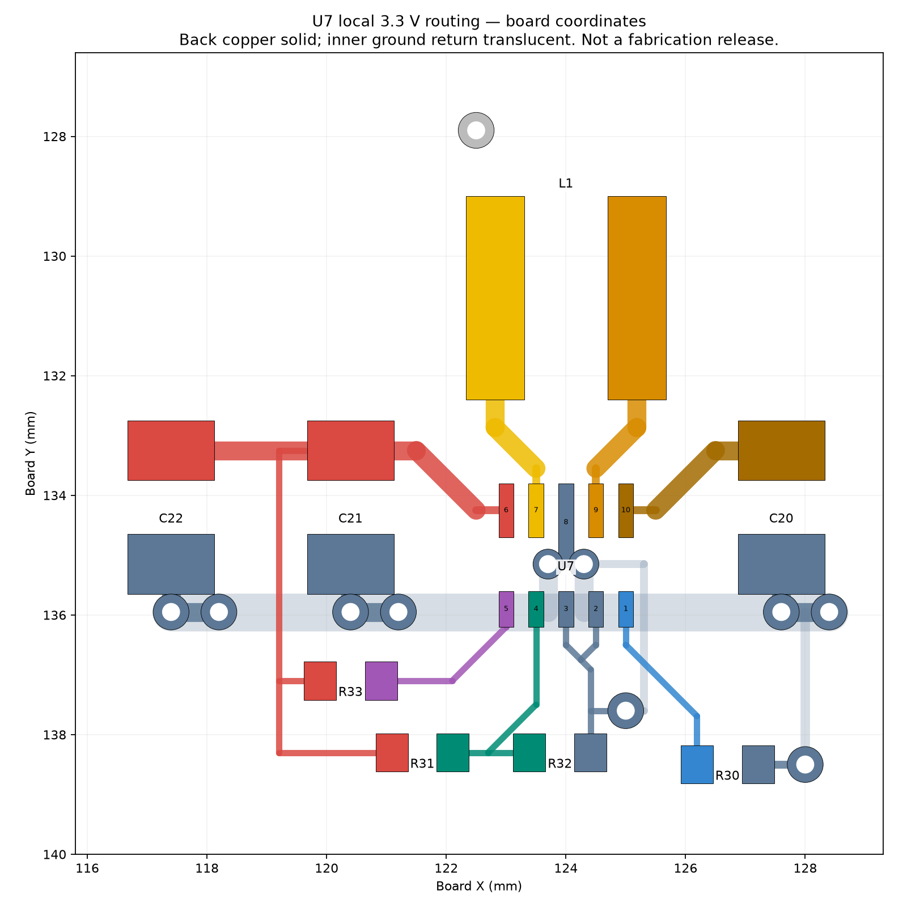

# Main 3.3 V converter routing — 22 September 2026

**Local layout completed; handset remains DO NOT FABRICATE OR POWER.**

The next step after physical population was to connect a foundational power
block. U7 supplies the main logic rail. Its local switching, feedback and
return paths now exist as copper, rather than airwires. This checkpoint does
not claim that the complete power system or handset operates.

## Saved changes

Repositioned U7, L1, C20–C22 and R30–R33 as a compact cell on the back of the
board. U7 is at (124, 135) mm. Added 51 track segments and ten through vias.
All 40 pre-existing copper items and every footprint outside this cell retained
their original locations, orientations and net assignments. No schematic net
or component value changed. The 170-part population and case/key coordinates
are preserved.

The layout uses short switch-node escapes to L1, local input/output capacitor
connections, a sense connection at C21, and a separate control-ground return.
Power traces widen from 0.25 mm IC escapes to 0.6 mm; the local inner-layer
power return is 1.2 mm wide. Two 0.3 mm drilled, 0.5 mm diameter vias share
U7's power-ground return. Capacitor returns use paired 0.3 mm drilled, 0.6 mm
diameter vias. These dimensions are geometry choices, not a verified current
or temperature-rise rating. No new via is centered in a component solder pad.

Placement follows the power-loop and feedback-routing principles in
[TI TPS63802, section 12](https://www.ti.com/lit/ds/symlink/tps63802.pdf).
The larger selected inductor package and existing keypad copper constrain
this implementation. The local return is routed on In1.Cu; whole-board
reference planes and external rail distribution remain to be designed.

## Verification

| Check | Result |
|---|---|
| Existing schematic/PCB integrity assertions | 1,619 / 1,619 passed |
| Local copper continuity | All 26 pads connected in eight expected net groups |
| Negative continuity test | Removing the feedback escape in memory correctly fails the test |
| Native schematic/PCB parity | 0 findings |
| Native placement/short/clearance findings added | 0 |
| Native DRC findings remaining | 4 existing USB1 hole-clearance findings |
| Native ERC findings remaining | 46, unchanged |
| Board-wide unconnected items | 491 → 473 |

`scripts/check_handset_3v3.py` examines KiCad's physical copper connectivity;
matching pad net names alone cannot pass it. The normal
`bash scripts/check_handset_pcb.sh` now includes this check. Full native exports
and board/assembly previews were refreshed after installation.

The source board and metadata are preserved in
`archive/handset-before-3v3-routing/7c2524658fd7/`.
`generated/reg3-routing.json` records the source hash and preservation checks.
`scripts/route_handset_3v3.py` prepares a temporary candidate and refuses to
rerun against the installed marker; it must not reset later manual edits.

## Still required

VSYS must reach C20, SYS_EN must reach U7/R30, and +3V3 and GND must reach
the loads. The PG pull-up is connected locally; host monitoring is not added.
Charger, other converters and modem supply routing remain incomplete.

Electrical qualification also remains open: exact passive MPNs and effective
capacitance under bias/temperature; feedback tolerance and LCD supply limits;
switching-node waveforms; input/output ripple; startup, load transients,
temperature rise, and full power/current budget. The nominal 560 kΩ / 100 kΩ
divider gives 3.3 V; that is not a guarantee of the worst-case rail voltage.
The existing 100 kΩ lower resistor is at TI's stated upper design limit and
needs tolerance review when its purchasing MPN is frozen.

The next power-system step is to resolve the battery/USB source policy and
charger input protection, then route the charger and main rail distribution.
See [release-blockers.json](release-blockers.json) for the wider product work.
